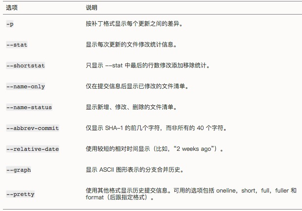

# Git 入门笔记

Git 学习笔记

学习资料：

- [Pro Git](https://git-scm.com/book/zh/v2)
- [Git 教程](https://www.liaoxuefeng.com/wiki/0013739516305929606dd18361248578c67b8067c8c017b000)

## 1. 起步

### 1.1 版本控制

- 本地版本控制系统，如 RCS
- 集中化的版本控制系统，如 CVS、SVN
- 分布式版本控制系统，如 Git

### 1.2 Git 基础

#### 数据的三种状态：

- 已提交 committed 数据已经保存在本地数据库中
- 已修改 modified 文件已修改，但还没保存到数据库中
- 已暂存 staged 对已修改的文件做了标记，包含在下次提交的快照中

#### 三个工作区域：

- 工作目录 Working Directory
- 暂存区域 Staging Area
- Git仓库 Repository

#### Git 工作流程

1. 修改文件，在工作目录中修改文件
1. 暂存文件，把文件的快照放入暂存区
1. 提交更新，把暂存区的文件快照存储到Git仓库目录

### 1.3 安装Git

#### 在Linux上安装

`$ sudo yum install git`

`$ sudo apt-get install git`

#### 在Mac上安装

- 安装Xcode Command Line Tools
- OSX Git 安装程序 [http://git-scm.com/download/mac](http://git-scm.com/download/mac)
- Github for Mac [http://mac.github.com/](http://mac.github.com/)

#### 在Windows上安装

- Git for Windows [http://git-scm.com/download/win](http://git-scm.com/download/win)
- Github for Windows [http://windows.github.com/](http://windows.github.com/)

### 1.4 Git 配置

#### 配置文件

1. `/etc/gitconfig` ：所有用户和仓库的通用配置
1. `~/.gitconfig` ：当前用户的配置，使用 --global 读写。
1. `.git/config` ：当前仓库配置

#### 用户信息

设置用户名称：

`$ git config --global user.name "your name"`

设置用户邮箱：

`$ git config --global user.email "name@example.com"`

如果只对当前仓库设置，不需要 `--global` 参数

#### 默认文本编辑器

设置文本编辑器

`$ git config --global core.editor emacs`

#### 检查配置信息

列出所有配置

`$ git config --list`

查看某一项配置

 `$ git config <key>`

### 1.5 获取帮助

- `$ git help <verb>`
- `$ git <verb> --help`
- `$ man git-<verb>`

## 2. Git 基础

### 2.1 获取 Git 仓库

#### 在现有目录中初始化仓库

`$ git init`

#### 克隆现有的仓库

`$ git clone <url> [<directory>]`

### 2.2 记录更新到仓库

工作目录下的文件状态：

1. 已跟踪 tracked
2. 未跟踪 untracked

Git 中文件的状态变化周期

#### 查看当前文件状态

查看详细状态：

`$ git status`

查看状态简览
`$ git status -s` 或 `$ git status --short`

#### 跟踪新文件，加入暂存区

`$ git add <file>`

#### 已修改的文件，加入暂存区

`$ git add <file>`

#### 忽略文件

`.gitignore`

文件格式规范：

- 空行和以 `#` 开头的行都会被忽略
- 支持标准的 `glob` 模式匹配
- 使用 `/` 开头防止递归
- 使用 `/` 结尾指定目录
- 使用 `!` 开头取反

`glob` 模式：

- `*` 匹配0个或多个任意字符
- `[]` 匹配任何一个方括号中的字符
- `?` 匹配一个任意字符
- `[0-9]` 匹配区间范围
- `**` 匹配任意中间目录

`.gitignore` 文件列表：

[https://github.com/github/gitignore](https://github.com/github/gitignore)

#### 对比文件，查看已暂存和未暂存文件的修改内容

比较工作目录和暂存区文件的差异：
`$ git diff`

比较暂存区的文件和仓库文件的差异：
`$ git diff --cached` 或 `$git diff --staged` (Git 1.6.1版本后)

检查空白错误：
`$ git diff --check`

#### 提交更新

把暂存区的文件快照提交到仓库中：

`$ git commit -m "提交说明"`

#### 路过暂存区域，直接提交

使用 `-a` 把已跟踪的文件直接提交到仓库

`$ git commit -a -m "提交说明"`

#### 移除文件

移除文件，是指把文件从已跟踪清单中移除，是从暂存区移除，同时从工作目录中移除：

`$ git rm <file>`

仅从跟踪清单中移除，并不从工作目录中删除：

`$ git rm --cached <file>`

如果文件已经修改且保存到暂存区，则需要使用 `-f` 强制移除

`$ git rm -f <file>`

#### 移动文件

`$ git mv <file_from> <file_to>`

### 2.3 查看提交历史

`$ git log`

经常用的组合选项：

`$ git log --graph --pretty=oneline --abbrev-commit`

`git log` 的常用选项：

`git log --pretty=format` 的常用选项：

限制输出长度的选项：

### 2.4 撤销操作

#### 重新提交

`$ git commit --amend`

#### 取消暂存的文件

`$ git reset HEAD -- <file>` 从暂存区撤销到工作区，既由暂存状态变为修改未暂存状态。

#### 撤销对文件的修改

`$ git checkout -- <file>` 撤销文件内容的修改

### 2.5 远程仓库

#### 查看远程仓库

`$ git remote`

选项 `-v` 显示读写远程仓库使用的简写与其对应的仓库地址

#### 添加远程仓库

`$ git remote add <remote-name> <url>`

#### 从远程仓库中拉取

`git fetch` 从远程拉取最新版本的数据到本地，但不会自动合并。

`git pull` 从远程拉取最新版本的数据到本地，并与本地的分支合并，相当于 `git fetch` 和 `git merge`。

#### 推送到远程仓库

`$ git push [remote-name] [branch-name]`

#### 检查远程仓库详细信息

`$ git remote show <remote-name>`

#### 重命名远程仓库

`$ git remote rename <old-name> <new-name>`

#### 删除远程仓库

`$ git remote rm <remote-name>`

### 2.6 标签

#### 列出标签

`$ git tag`

#### 查看特定标签

`$ git tag -l 'v1.2.2*'`

#### 创建标签

轻量标签：

- 给最新的commit创建标签： `$ git tag <name>`
- 给某个版本创建标签： `$ git tag <name> <版本号>`

附注标签：

- 给标签添加附注信息： `$ git tag <name> -a -m "标签说明"`

#### 查看标签

- 查看所有标签： `$ git tag`
- 查看某一标签详情： `$ git show <tag-name>`

#### 推送标签到远程仓库

- 推送指定标签： `$ git push origin <tag-name>`
- 推送全部未推送的标签： `$ git push origin --tags`

#### 删除标签

- 删除本地标签： `$ git tag -d <tag-name>`
- 删除远程标签： `$ git push origin :ref/tags/<tag-name>`

### 2.7 Git 别名

使用 `git config` 为 Git 命令设置别名

- `$ git config --global alias.ck checkout`
- `$ git config --global alias.br branch`
- `$ git config --global alias.cm commit`
- `$ git config --global alias.st status`

- `$ git config --global alias.unstage 'reset HEAD --'`
- `$ git config --global alias.last 'log -1 HEAD'`

## 3. Git分支

### 3.1 分支简介

`HEAD` 指针

### 3.2 分支的新建与合并

- 创建分支： `$ git branch <branch-name>`
- 切换分支： `$ git checkout <branch-name>`
- 创建并切换分支： `$ git checkout -b <branch-name>`
- 合并分支： `$ git merge <branch-name>`

### 3.3 分支管理

- 删除分支： `$ git branch -d <branch-name>`
- 强制删除分支： `$ git branch -D <branch-name>`
- 查看分支： `$ git branch`
- 查看分支的最后一次提交： `$ git branch -v`
- 查看分支的最后提交和跟踪分支： `$ git branch -vv`
- 查看合并到当前分支的所有分支： `$ git branch --merged`

### 3.4 分支开发工作流

#### 长期分支

`master` 分支，稳定分支

渐进稳定分支的线性图：

渐进稳定分支的流水线视图：

#### 特性分支

短期分支，实现单一特性。

拥有多个特性分支的提交历史：

### 3.5 远程分支

`<remote-name>/<branch-name>`

从远程克隆时， `git clone` 命令默认远程仓库名为 `origin` ，并在本地创建一个 `master` 分支。

克隆之后的服务器与本地仓库：

本地与远程的工作分叉：

从远程抓取数据到本地：

#### 推送分支

`$ git push <remote-name> <branch-name>`

#### 跟踪分支

跟踪分支是与远程分支有直接关系的本地分支。在跟踪分支上 `git pull`时，Git能自动识别去哪个服务器上抓取、合并到哪个分支。

克隆项目时，自动创建一个跟踪 `origin/master` 的 `master` 分支。

自己设置跟踪分支，分支名称可以与远程分支名不同： `$ git checkout -b <branch-name> <remote-name>/<branch-name>`

使用 `--track` 选项设置跟踪同名的远程分支： `$ git checkout --track <remote-name>/<branch-name>`

设置已存在的本地分支跟踪一个刚拉取下来的远程分支，或者修改正在跟踪的分支，使用 `-u` 或 `--set-upstream-to`：
`$ git branch -u <remote-name>/<branch-name>`

#### 删除远程分支

`$ git push <remote-name> --delete <branch-name>`

### 3.6 变基

`rebase` 将提交到某一分支上的修改移至另一分支上。

1. `$ git checkout dev`
1. `$ git rebase master`
1. `$ git checkout master`
1. `$ git merge dev`

使用变基的总原则是：

***只对本地修改执行变基操作，从不对已推送至别处的提交执行变基操作***
